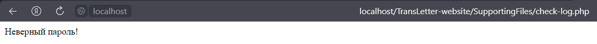

# TransLetter-website

## University project of creating website.

Website of online translating documents.

## Functions implemented on the website

### 1. Registration:

If data base table "users" have user and password is correct it will logged in.   

If an incorrect username is entered, a corresponding inscription will be displayed.     

If a wrong password is entered? a corresponding inscription will be displayed.      

### 2. Profile page:

Sign out feature implemented on the profile page.       

### 3. About page:

On this page you can see all product and add some to cart. Items will be saved in table "shopcart"      
to this user.     
Also, you can share this site.

As the admin you can add products to the list.      

### 4. Contacts page:

On this page is the feedback chat, contacts and the map implemented by the yandex map api.      
!        

As the admin you can respond to questions.

### 5. Shopcart page:

Here you can delete items from your cart.

### 6. Users page:

Admin has users page instead of shopcart. On this page admin can delete users from the db.

### 7. Registration page:

On the registration page there is validable registration form.

